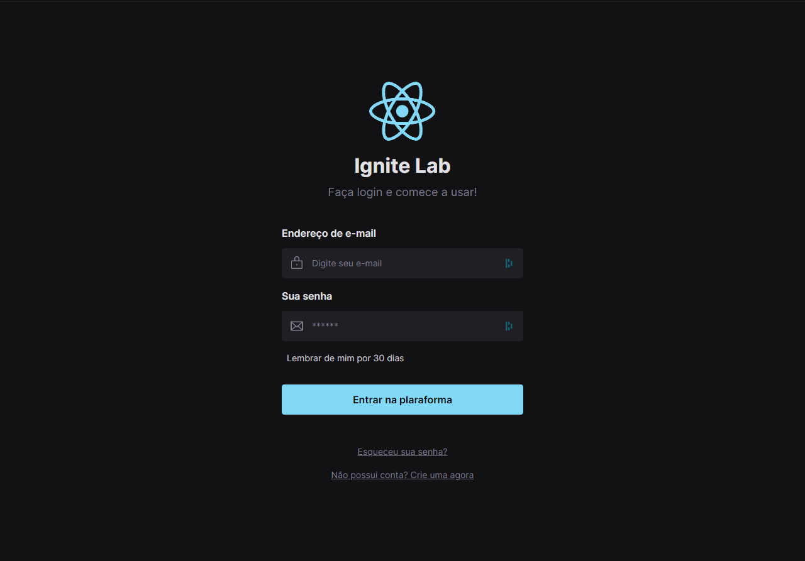
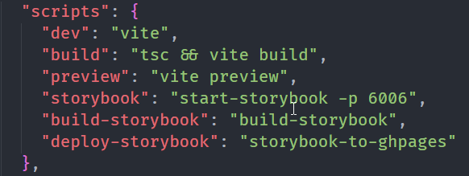

<h1  align ="center">React-Design-System</h1>

 

_**```Construção de um Design System do Figma para o código, com documentação usando Storybook (Ignite Lab by Rocketseat)```**_

[](https://lucassrlkz.github.io/react-design-system/)

<br>

### 🔨 Ferramentas e Tecnologias

Usadas no projeto:

[](https://vitejs.dev/logo.svg) [](https://tailwindcss.com/) [](https://storybook.js.org/) [](https://storybook.js.org/) [](https://mswjs.io/) [](https://phosphoricons.com/)

<br>

## 💻 Pré-requisitos

Antes de começar, verifique se você atendeu aos seguintes requisitos:

* Instalar o [NodeJs](https://nodejs.org/en/)

<br>

## 🚀 Instalando <React-Design-System>

Para instalar o <i>react-design-system</i> siga estas etapas:

* Clonar o repositório com:
  
  ```bash
  git clone https://github.com/lucassrlkz/react-design-system.git
  ```
<br>

## ☕ Usando <React-Design-System>

Para usar o <i>react-design-system</i> siga estas etapas:

* Entrar na pasta do projeto, instalar as dependências e rodar o projeto:
  
  ```bash
  cd react-design-system
  
  npm install

  npm run dev
  ```
<br>

## 🖊 Scripts

**Scripts encontrados dentro do package.json**

 
